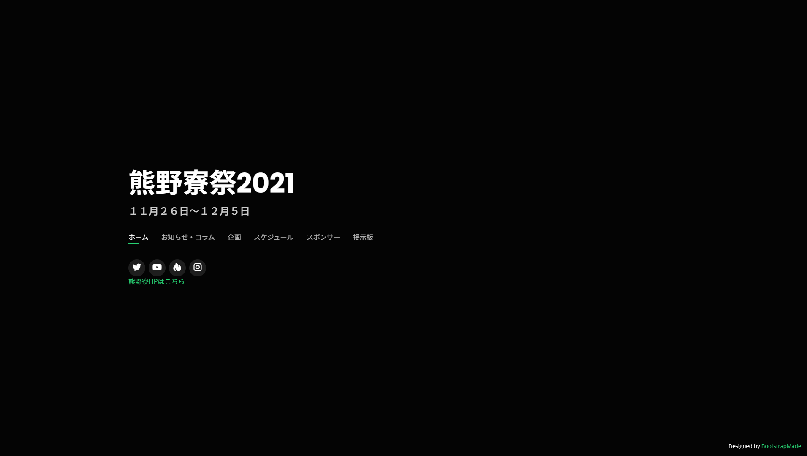
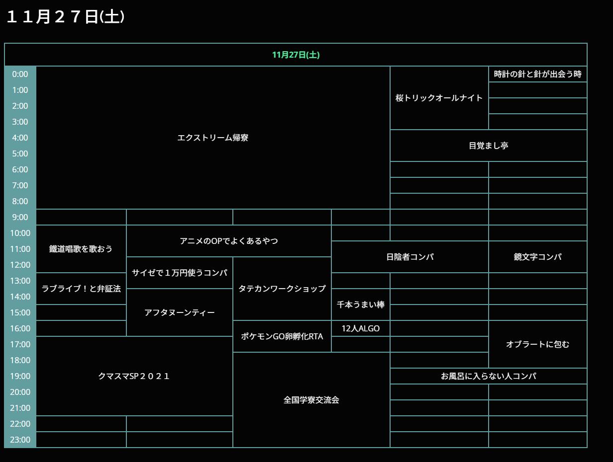
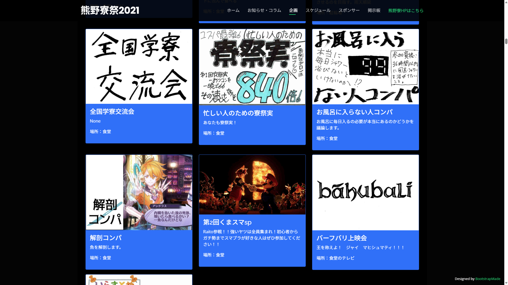
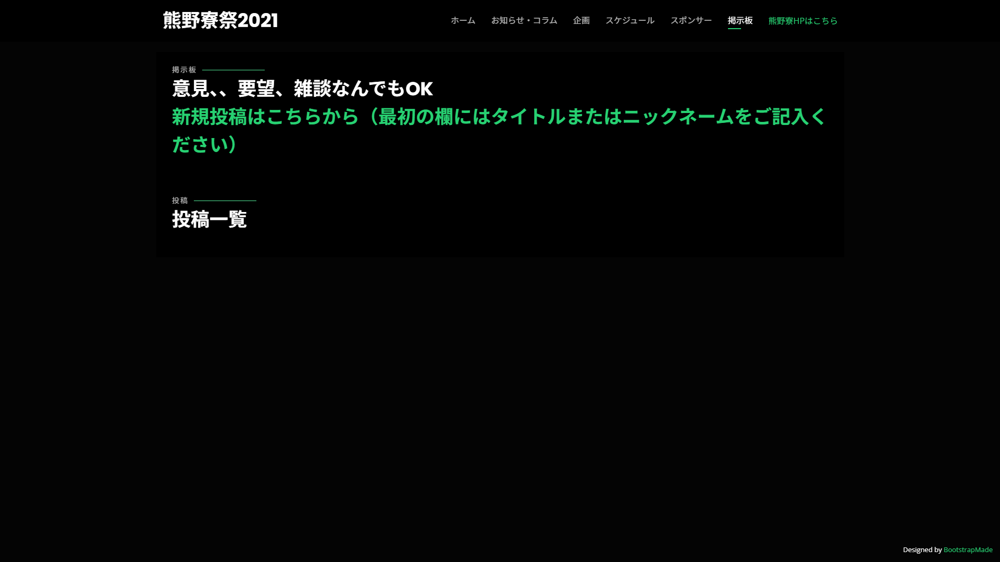

# 熊野寮祭 2021 公式ホームページ

京都大学の寮祭（熊野寮祭2021）の公式ホームページです。
10日間のイベントスケジュール・掲示板・コラム・スポンサー情報を一つのサイトにまとめました。

---

## 技術スタック


---

## 実際のWebサイト

> デプロイ先URL: [https://kumano-ryosai-2021.com/](https://kumano-ryosai-2021.com/)

スクリーンショット等で雰囲気を確認できます（下記参照）。

---

## スクリーンショット

| トップページ | スケジュール表 |
|:---:|:---:|
|  |  |

| 企画一覧 | 掲示板 |
|:---:|:---:|
|  |  |

---

## 機能一覧

- **トップページ**: イベント概要・開催期間中の全スケジュール表（10日分）
- **日付別コラムページ**: 寮生によるコラム・メッセージ（11/24〜12/1）
- **掲示板機能**: 参加者が自由に投稿・閲覧できるフォーラム
- **スポンサー紹介**: 協賛企業・団体の紹介セクション

---

## 工夫したポイント

### 1. 静的サイトの設計による高速化

動的レンダリングはサーバー負荷が高く、アクセス集中時にサイトが重くなるリスクがあります。
そこで**スケジュール・コラム等の変更されないコンテンツはHTMLテンプレートに直書き**し、DBへのクエリをほぼゼロにする設計を採用しました。

一方、掲示板など動的に更新が必要な部分のみDjangoのモデル+ビューで実装し、**静的・動的コンテンツを明確に分離**しています。

### 2. Excelによるスケジュール表のHTML自動生成

10日分・24時間のスケジュール表を手書きHTMLで管理するのは非現実的です。
そこで**Excelのセル結合とCONCATENATE関数**を使って`<td rowspan>` / `<td colspan>` を含むHTML文字列を自動生成し、それをテンプレートにコピーペーストする手法を採用しました。

```
Excel上でイベント時間帯を入力
    ↓
CONCATENATE関数でHTMLタグを結合・生成
    ↓
生成されたHTMLをテンプレートにコピー
```

コーディング工数を大幅に削減しつつ、非エンジニアのメンバーでも内容更新に参加できる体制を整えました。

### 3. Dockerによる再現性の高い開発・デプロイ環境

Dockerfileで環境を定義し、**開発環境と本番環境の差異をなくしました**。
またポートを環境変数経由で受け取ることでクラウドPaaSに柔軟に対応しています。

```dockerfile
CMD ["sh", "-c", "gunicorn --bind 0.0.0.0:$PORT ryosai.wsgi"]
```

### 4. 開発環境と本番環境のDB切り替え

`dj-database-url` を活用し、環境変数`DATABASE_URL`の有無でSQLite（開発）とPostgreSQL（本番）を自動切り替えできる設計にしています。ローカルでは設定不要で即起動でき、本番はクラウドDBに接続されます。

---

## ディレクトリ構成

```
ryosai/
├── ryosai/               # プロジェクト設定
│   ├── settings.py
│   └── urls.py
├── ryosai_2021/          # メインアプリ
│   ├── models.py         # Post / Category / Tag / Pro モデル
│   ├── views.py          # ListView / CreateView / TemplateView
│   ├── urls.py
│   └── templates/        # HTMLテンプレート
│       ├── index.html    # トップページ（スケジュール表含む）
│       ├── list.html     # 掲示板一覧
│       ├── create.html   # 投稿フォーム
│       └── 1124〜1131.html # 日付別コラム
├── static/
│   ├── css/style.css     # カスタムスタイル（ダークテーマ）
│   ├── js/main.js        # ナビゲーション・スムーススクロール
│   └── vendor/           # Bootstrap5 / GLightbox / Swiper 等
├── Dockerfile
├── Procfile
└── requirements.txt
```

---

## セットアップ（ローカル）

```bash
# リポジトリをクローン
git clone https://github.com/<your-username>/ryosai.git
cd ryosai

# 依存関係をインストール
pip install -r requirements.txt

# マイグレーション実行
python manage.py migrate

# 開発サーバー起動
python manage.py runserver
```

Dockerを使う場合:

```bash
docker build -t ryosai .
docker run -e PORT=8000 -p 8000:8000 ryosai
```

---

## 使用ライブラリ

| ライブラリ | 用途 |
|---|---|
| Django 3.2 | Webフレームワーク |
| Gunicorn | WSGIアプリサーバー |
| dj-database-url | DB接続設定の環境変数管理 |
| psycopg2 | PostgreSQLアダプター |
| Pillow | 画像処理 |
| Bootstrap 5 | CSSフレームワーク |
| Swiper | カルーセル・スライダー |
| GLightbox | ライトボックスギャラリー |
| Isotope | フィルタリングレイアウト |

